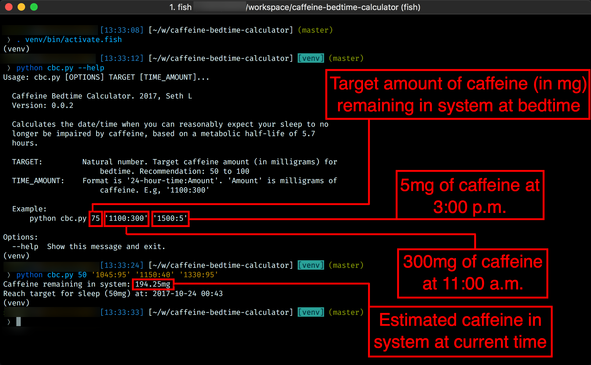

# cbc.py 

Caffeine Bedtime Calculator. 2017 Seth L

Version: 0.0.2

---

Calculates the date/time when you can reasonably expect your sleep to no
longer be impaired by caffeine, based on a metabolic half-life of 5.7
hours.

Arguments:

    TARGET:         Natural number. Target caffeine amount (in milligrams) for
                        bedtime. Recommendation: 50 to 100
    TIME_AMOUNT:    Format is '24-hour-time:amount'. 'Amount' is milligrams of
                        caffeine. E.g, '1100:300'

Example:

    python cbc.py 75 '1100:300' '1500:5'

* `75` is how many milligrams of caffeine the user wants in their system at bedtime. 
* `'1100:300'` means the user had 300mg of caffeine at 11:00 a.m.
* `'1500:5'` means the user had 5mg of caffeine at 3:00 p.m.

## Prerequisites

1. Python 3 
2. pip (pip3, for Python 3)
3. virtualenv (`pip install virtualenv`)

## Installation 

    # Clone repo
    git clone https://github.com/sethll/caffeine-bedtime-calculator.git
    cd caffeine-bedtime-calculator

    # Using a virtual environment is recommended, but not required. You may
    # skip these steps. 
    virtualenv venv -p python3
    . venv/bin/activate

    # Install dependencies
    pip install -r requirements.txt

